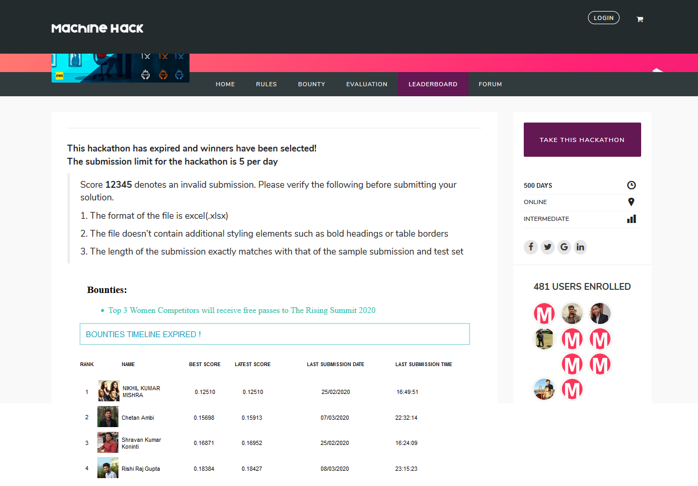

# 4th place solution

# MachineHack-Food-Quality-Assessment

MachineHack is back with an exciting hackathon and this time we challenge the women in the analytics space. As AIM prepares itself for the 2nd Edition of the Women in Analytics Conference – The Rising 2020, we look forward to women data scientists to take part in this exciting hackathon to stand a chance to win free passes to the conference.

Top 3 women competitors will win free passes to The Rising  2020.

To know more about The Rising 2020, click here.
Problem Description

    The food inspection department conducts regular inspection on food quality for various restaurants in the city. It’s a very well documented procedure and over time some good amount of data has been generated out of these inspections. 

    The inspection department would like to predict where they should focus most in terms of their next inspection schedule, so that they can most optimize their time at hand to catch the worst offenders. Can the past inspection or any data that they have collected predict which facility will pass or fail.

    In this hackathon, MachineHack provides you with a subset of this dataset with information on food quality checks conducted on thousands of facilities that serve food across multiple cities. Your objective as a Data Scientist is to predict whether a facility will pass or fail the inspection based on a number of factors.

Objective

Build a predictive model that is capable of predicting the outcome of an inspection conducted in a facility based on the given set of features

Features : 

    ID: A unique id for each inspection

    Date: The date at which the inspection was done in a particular facility

    LicenseNo: De-identified license number for a particular facility

    FacilityID: De-identified unique facility id  for a facility

    FacilityName: The encoded name of a facility

    Type: The type of the facility being inspected

    Street: The encoded street where the facility is located

    City: The encoded city where the facility is located

    State: The encoded state where the facility is located

    LocationID: An encoded location feature.

    Reason: The primary reason for the inspection

    SectionViolations: Laws violated by the facility

    RiskLevel: The level of risk the facility possesses to the consumers.

    Geo_Loc: De-identified geo location of the facility

    Inspection_Results: The result of the inspection

Target :

The inspection results can have any of the following values :

    0:’FACILITY CHANGED’
    1:’FAIL’
    2:’FURTHER INSPECTION REQUIRED’,
    3:’INSPECTION OVERRULED’
    4:’PASS’
    5:’PASS(CONDITIONAL)’
    6:’SHUT-DOWN’

Data Sets:

        Data_Train.xlsx – 147443 rows × 15 columns
        Data_Test.xlsx – 49148 rows × 14 columns
        Sample_Submission.xlsx – 49148 rows × 7 columns

